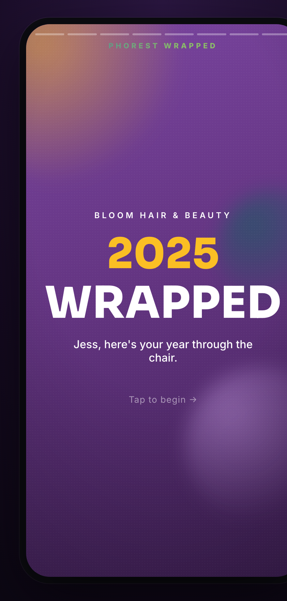

# Phorest Wrapped 🎁

A "Spotify Wrapped"-style, story-based recap of a staff member's year — built
mobile-first, fully animated, and styled with Phorest's brand palette.



## Run it

```bash
npm install
npm run dev      # http://localhost:5173
```

```bash
npm run build    # type-check + production bundle in dist/
npm run preview  # serve the production build
```

## The experience

Eight full-screen story slides, Instagram/Spotify-style:

1. **Intro** – salon + year build-up
2. **Client visits** – 1,247
3. **Service sales** – €68,420
4. **Retail sales** – €9,860
5. **Average bill** – €62 / visit
6. **Tips** – €4,215
7. **Rebooked** – 73% (animated ring gauge, the hero metric)
8. **Summary** – shareable recap card + confetti

### Controls

| Action | Gesture |
| --- | --- |
| Next / previous | tap right / left (or `→` / `←`) |
| Pause | press & hold (or `space`) |
| Auto-advance | ~6s per slide, segmented progress bars up top |
| Share | Web Share API, falls back to clipboard copy |
| Replay | button on the summary card |

Respects `prefers-reduced-motion` (instant counts, no confetti, static blobs).

### Deep links (handy for demos / QA)

- `?s=N` – start on slide `N` (0–7)
- `?paused=1` – start paused

## Where things live

- `src/data/wrapped.ts` – **all hardcoded data** (staff, salon, metrics).
  Numbers are internally consistent: `(service + retail) / visits ≈ average bill`.
- `src/components/slides/index.tsx` – slide registry + per-slide colour themes.
- `src/components/StoryPlayer.tsx` – navigation, auto-advance, progress, gestures.
- `src/components/AnimatedNumber.tsx` – count-up via a Framer `MotionValue`.
- `src/index.css` – Phorest brand tokens (the tree-named palette: oak, birch,
  fir, chestnut, ash, cherry + brand teal/green/yellow), lifted from
  `consultation-webapp`.

## Tech

Vite · React · TypeScript · Framer Motion · canvas-confetti.

## Notes

- Data is hardcoded for now; swapping in a real per-staff feed is a matter of
  replacing the `wrapped` export (and, later, fetching by staff id).
- The brand colours mirror Phorest's existing design tokens so it sits visually
  alongside the rest of the product.
